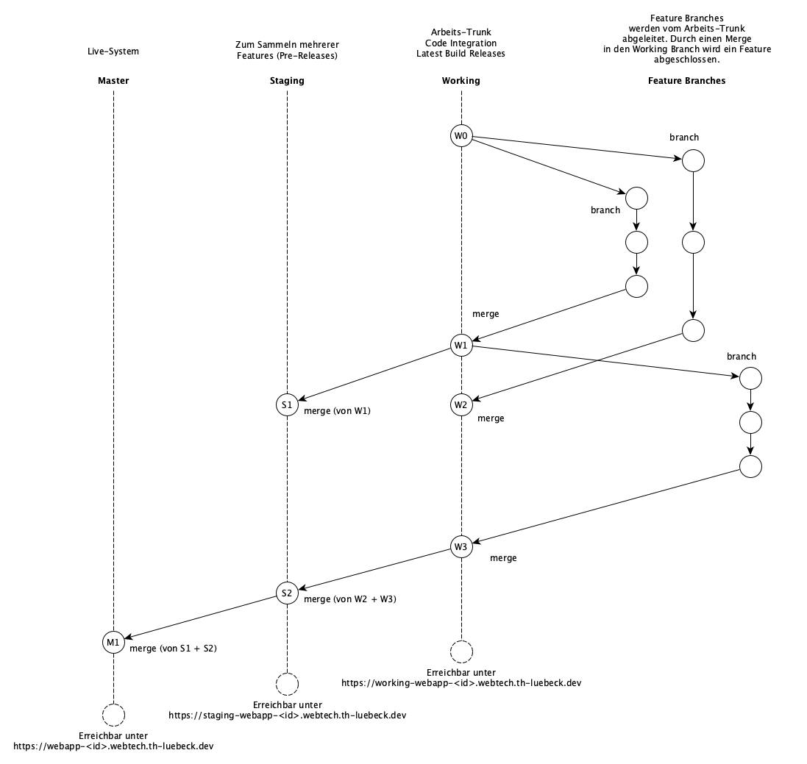

# Game Template

Dieses Repository ist genauso aufgebaut, wie das Barebones-Projekt was Sie initial bearbeitet haben auch. Nutzen Sie dieses Template daher bitte als Ausgangsbasis für Ihr Spiel.

Es basiert auf dem `Web-Simple` Template von Dart.

## Branching Model

Die Deployment Pipeline kann mittels Branches unterschiedliche Versionen Ihres Games bereitstellen. Es obliegt grundsätzlich Ihnen, welchem Branching Model Sie in Ihrem Projekt folgen. Exemplarisch könnte Ihr Branching Modell bspw. so aussehen:

- Der Staging-Branch ist einmal vom Master-Branch initial abgezweigt worden.
- Vom Staging-Branch ist ferner der Working-Branch initial abgezweigt worden (Working und Staging "schützen" also die Production Line, d.h. den Master-Branch).
- Der Working-Branch wäre in diesem Modell ihre zentrale Referenz im Team. Änderungen nehmen Sie immer relativ zu dem Working-Branch (ggf. mittels [Feature Branches](https://martinfowler.com/articles/branching-patterns.html#feature-branching)) vor.
- Wollen Sie mehrere Änderungen des Arbeitsstands als "Vorabversion" bereitstellen, können Sie einen Merge mittels eines [Merge Requests](https://docs.gitlab.com/ee/user/project/merge_requests/) vom aktuellen Working-Stand in den Staging Branch übernehmen.
- Wollen Sie ein offizielles Release bereitstellen, können Sie dies mittels eines Merge Requests vom aktuellen Staging-Stand in den Master Branch übernehmen.

Dieses Branching Model ist für ein Projekt ihrer Größe ggf. schon ein wenig groß. Vermutlich können Sie auf den Staging (oder Working) Branch verzichten (dennoch sollten Sie ihre Production Line von der Development Line trennen). Mittels dieses Branching Modells können bspw.

- die "offizielle" Gameversion (aus dem Master-Branch)
- eine "Vorab-"Version (aus dem Staging-Branch)
- und eine "Edge-"Version (aus dem Working-Branch)

parallel gefahren werden. Mit wievielen Branches Sie arbeiten ist Ihnen überlassen. Es wird jedoch empfohlen, den Master-Branch mindestens durch einen "schützenden" Staging/Working-Branch zu "schützen". Machen Sie sich ggf. mit entsprechenden Branching Strategien vertraut.

- [Informatik Aktuell](https://www.informatik-aktuell.de/entwicklung/methoden/multiple-verzweigungen-git-branching-modelle-im-taeglichen-einsatz.html)
- [Gitlab](https://docs.gitlab.com/ee/topics/gitlab_flow.html)
- [Atlassian](https://www.atlassian.com/de/git/tutorials/comparing-workflows)

> **Tipp:** Halten Sie in jedem Fall ihr Branching Model möglichst einfach, schützen Sie aber Ihre Production Line (also in unserem Fall den Master-Branch). Insbesondere wenn Sie zum ersten Mal eine Versionsverwaltung mit mehreren Personen verwenden, nutzen Sie im Zweifelsfall ausschließlich die Merge und Pull Request Features der GitLab Web UI (und nicht die Kommandozeile von `git`).

## Konfiguration der Deployment-Pipeline und Kubernetes

Wenn Sie einen Commit in einem Branch erstellen, wird die Pipeline gestartet und ein Container und Service in Kubernetes erzeugt mit dem Namen des Branches als Prefix.

> **Achtung:** Ihre Branchnamen müssen daher klein geschrieben sein und DNS-konform sein (u.a. keine Punkte . beinhalten!).

Wenn Sie also bspw. einen Branch `my-branch` anlegen und in diesen Committen/Pushen sorgt die Pipeline dafür, dass ein Container namens `my-branch-webapp-xyz` und ein Service namens `my-branch-webapp-svc` angelegt wird.

Mittels `kubectl port-forward svc/my-branch-webapp-svc 8888:80` können Sie so die aktuelle Version ihres Games unter [http://localhost:8888](http://localhost:8888) im Cluster spielen und testen.

> __Achtung:__ Sie können maximal 20 Pods im Cluster erzeugen. Sie können also nicht mehr als 20 Branches parallel laufen haben. Ggf. müssen Sie alte Feature Branch Pods und Services mittels [Lens](https://k8slens.dev) löschen.

Sollten Sie in Ihrem Team Arbeitsaufträge vergeben, sollten Arbeitsaufträge mittels eines Feature Branches realisiert werden. Arbeitsaufträge sollten dabei so dimensioniert sein, dass diese innerhalb eines Tages realisiert und in den Working-Branch mergen. Halten Sie Feature Branches nicht zu lange offen! Ansonsten laufen Sie Gefahr, dass Ihre Code-Stände über mehrere Teammitglieder zu weit auseinander laufen und Sie Probleme beim mergen bekommen!

## Exponieren Ihres Games

Die Pipeline ist ferner so konfiguriert, dass Sie Ihr Spiel mittels einer Ingress Ressource exponieren können. Dadurch wird Ihr Spiel öffentlich im Internet bereitgestellt.

Um diese Ingress Ressource zu erstellen, müssen Sie in der Datei `.gitlab-ci.yml` die Variable `variables.INGRESS` auf `"True"` setzen.

Die Pipeline erstellt dann drei Endpunkte, die auf die jeweiligen Versionen der Master-/Staging-/Working-Branches zeigen:

- Master: `https://webapp-<project-id>.webtech.th-luebeck.dev`
- Staging: `https://staging-webapp-<project-id>.webtech.th-luebeck.dev`
- Working: `https://working-webapp-<project-id>.webtech.th-luebeck.dev`

Mindestens zu den Zwischenpräsentationen müssen Sie den Master-Branch Ihres Spiels auf diese Art exponieren.

Ob Sie auch die Staging/Working Endpoints nutzen wollen, bleibt Ihnen überlassen.
